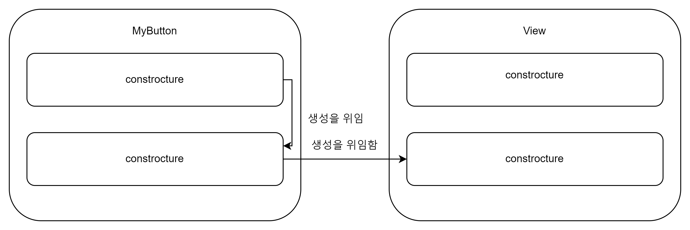

# 4.클래스, 객체, 인터페이스

## 4.1 클래스 계층 정의

### 4.1.1 코틀린 인터페이스

```kotlin
interface Clickable {
    fun click()
}

class Button : Clickable {
    override fun click() {
        println(" I was Clicked")
    }
}
```

- 클래스 이름 뒤에 콜론을 붙이고 인터페이스와 클래스 이름을 적는 것으로 클래스 확장과 인터페이스 구현을 모두 처리한다.
- 자바와 동일하게 인터페이스는 다중 상속 가능, 클래스는 하나만 상속이 가능하다.
- @Override 어노테이션과 비슷한 ovverride 변경자는 상위 클래스나 상위 인터페이스에 있는 프로퍼티나 메소드를 오버라이드 한 표시
- 실수로 상위 클래스의 메소드나 프로퍼티를 오버라이드 하는 것을 방지한다.
- 자바와 마찬가지 디폴트 구현이 가능하다.
- 코틀린의 경우 override 키워드를 생략할 수 없다.

```kotlin
interface Clickable {
    fun click()
    fun showOff() = println("I'm Clickable")
}

interface Focusable {
    fun setFocus(b: Boolean) = println("I ${if (b) "got" elsa "lost"} focus.")
    fun showOff() = println("I'm focusable!")
}

class Button : Clickable, Focusable {
    override fun click() {
        println("I was clicked")
    }

    override fun showOff() {
        super<Clickable>.showOff()
        super<Focusable>.showOff()
    }
}
```

- 같은 메소드를 가진 인터페이스를 함께 구현하면 어느쪽도 선택 되지 않는다.
- 두 메소드를 아우르는 하위 클래스에 직접 구현하게 강제 한다.

### 4.1.2 open, final, abstract 변경자: 기본적으로 final

> **취약한 기발 클래스**
> 하위 클래스가 기반 클래스에 대해 가졌던 가정이 기반 클래스를 변경함으로써 깨져버린 경우에 생긴다. 
> 어떤 클래스가 자신을 상속하는 방법에 대해 정확한 규칙을 제공하지 않는다면 그 클래스의 크라이언트는 기반 클래스를 작성한 사람의 의도와 다른 방식으로 메소드를 오버라이드 할 위험이 있다.

- 코틀린은 클래스와 메소드는 기본적으로 final 키워드를 통해 상속을 불가능하게 한다.
- 어떤 클래스의 상속을 허용하기 위해선 클래스 앞에 open 변경을 붙여야 한다.
- 오버라이드 하고 싶은 메소드와 프로퍼티 앞에도 open 키워드를 붙여야 한다.

```kotlin
interface Clickable {
    fun click()
    fun showOff() = println("I'm Clickable")
}

open class RichButton : Clickable {
    fun disable() {}
    open fun animate() {}
    override fun click() {}
}
```

```kotlin
interface Clickable {
    fun click()
    fun showOff() = println("I'm Clickable")
}
//오버라이드 금지
open class RichButton : Clickable{
    final override fun click()
}
```
```kotlin
abstract class Animated{ //이 클래스는 추상클래스다. 이 클래스의 인스턴스를 만ㄷ들 수 없다.
    abstract fun animate() // 이 함수는 추상함수다. 이 함수에는 구현이 없다. 하위 클래스에서는 이 함수를 반드시 오버라이드해야 한다..
    
    open fun stopAnimating(){ 
    //추상 클래스에 속했더라도 비추상 함수는 기본적으로 파이널이지만 원한다면 open으로 오버라이드를 허용할 수 있다.
    }
    
    fun  animateTwice(){
        
    }
}
```
- 인터페이스의 멤버의 경우 항상 열려있으며 final로 변경할 수 없다.
- 안터페이스 멤버에게 본문이 없으면 자동으로 추상 멤버가 되지만, 따로 멤버 선언 앞에 abstract 키워드를 덧붙일 필요가 없다.

### 4.1.3 가시성 변경자: 기본적으로 공개
> visibility modifier는 코드 기반에 있는 선언에 대한 클래스 외부 접근을 제어한다. 
> 어떤 클래스의 구현에 대한 접근을 제한함으로써 그 클래스에 의존하는 외부 코드를 깨지 않고도 클래스 내부 구현을 변경할 수 있다.

| **변경자**           | **클래스 멤버**              | **최상위 선언**             |
|---------------|---------------------|--------------------|
| public(기본가시성) | 모든 곳에서 볼 수 있다.      | 모든 곳에서 볼 수 있다.     |
| internal      | 같은 모듈 안에서만 볼 수 있다.  | 같은 모듈 안에서만 볼 수 있다. |
| protected     | 하위 클래스 안에서만 볼 수 있다. | (최상위 선언에 적용할 수 없음) |
| private       | 같은 클래스 안에서만 볼 수 있다. | 같은 파일안에서만 볼 수 있다.  |

```kotlin
class Button : View{
    override fun getCurrentState() : State = ButtonState()
    override fun restoreState(state:Stete) {}
    
    class ButtonState : State {}
}
```

| 클래스 B 안에 정의된 클래스 A               | 자바에서는          | 코틀린에서는        |
|----------------------------------|----------------|---------------|
| 중첩된 클래스(바깥쪽 클래스에 대한 참조를 저장하지 않음) | static class A | class A       |
| 내부 클래스(바깥쪽 클래스에 대한 참조를 저장함)      | class A        | inner class A |

```kotlin
class Outer{
    inner class Inner{
        fun getOuterReference() : Outer = this@Outer
    }
}
```

### 4.1.5 봉인된 클래스: 클래스 계층 정의 시  계층 확장 제한
```kotlin
interface Expr
class Num(val value:Int) : Expr
class Sum(val left:Expr, val right:Expr) : Expr

fun eval(e: Expr):Int = 
    when(e) {
        is Num -> e.value
        is Sum -> eval(e.right) + eval(e.left)
        else ->
            throw IllegalArgumentException("~~")
    }
```
> sealed 클래스는 상위 클래스에 sealed 변경자를 붙이면 그 상위 클래스를 상속한 하위 클래스 정의를 제한 할 수 있다.
> sealed 클래스의 하위 클래스를 정의할 때는 반드시 상위 클래스 안에 중첩시켜야 한다.
```kotlin
sealed class Expr{ //기반 클래스를 sealed로 봉인한다.
    class Num(val value: Int) : Expr() //기반 클래스의 모든 하위 클래스를 중첩클래스로 나열한다.
    class Sum(val left:Expr, val right:Expr) : Expr()
}

fun eval(e: Expr):Int =
    when(e) { //when 식이 모든 하위 클래스를 검사하므로 별도의 else 분기가 없어도 된다.
        is Num -> e.value
        is Sum -> eval(e.right) + eval(e.left)
    }
```

## 4.2 뻔하지 않은 생성자와 프로퍼티를 갖는 클래스 선언

### 4.2.1 클래스 초기화: 주 생성자와 초기화 블록

```kotlin
class User(val nickname: String) // 주생성자

class User(_nickname:String){ //파라미터가 하나뿐인 주 생성자
    val nickname : _nickname //프로퍼티를 주 생성자의 파라미터로 초기화한다.
}

class User(val nickname: String, //생성자 파라미터에 대한 디폴트 값을 제공한다.
    val isSubscribed: Boolean = true)
```

### 부 생성자: 상위 클래스를 다른 방식으로 초기화

일반적으로 코틀린에서는 생성자가 여럿 있는 경우가 자바 보다는 적다. 자바에서 오버로드한 생성자가 필요할 경우 
상당 수는 코틀린의 default 파라미터 값과 이름 붙은 인자 문법을 사용해 해결할 수 있다.

```kotlin

import javax.swing.text.AttributeSet

open class View {
    constructor(ctx: Context) { // 부생성자

    }

    constructor(ctx: Context, attr: AttributeSet){ // 부생성자
        
    }
}

class MyButton : View {
    constructor(ctx: Context): super(ctx){ //상위 클래스의 생성자를 호출한다.
        
    }

    constructor(ctx: Context, attr: AttributeSet): super(ctx, attr){ //상위 클래스의 생성자를 호출한다.

    }
}
```


```kotlin

import javax.swing.text.AttributeSet

open class View {
    constructor(ctx: Context) { // 부생성자

    }

    constructor(ctx: Context, attr: AttributeSet){ // 부생성자
        
    }
}

class MyButton : View {
    constructor(ctx: Context): this(ctx, MY_STYLE){ //이 클래스의 다른 생성자에게 위임한다.
        
    }

    constructor(ctx: Context, attr: AttributeSet): super(ctx, attr){

    }
}
```



### 4.2.3 인터페이스에 선언된 프로퍼티 구현

```kotlin
interface User{
    val nickname: String
}

class PrivateUser(override val nickname: String) : User

class SubscribingUser(val email: String) :User {
    override val nickname: String
        get()= email.substringBefore('@')
    
class FacebookUser(val accountId: Int): User {
    override val nickname = getFacebookName(accountId)
}   
}
```